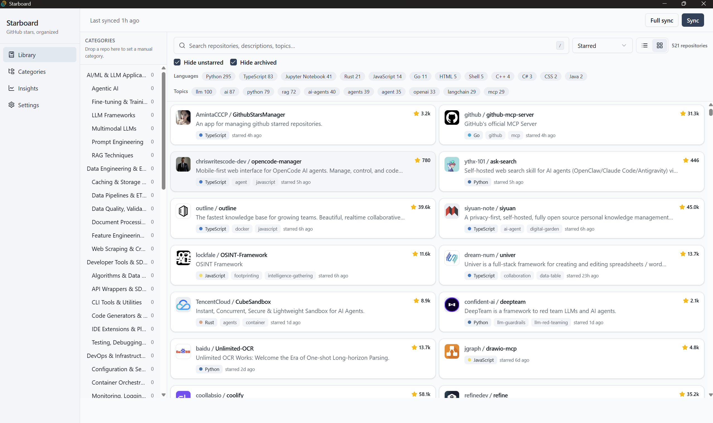

# Starboard

Local-first desktop app for organizing GitHub stars.

I tend to star interesting repositories while browsing GitHub, Hacker News, Reddit, Twitter, and blog posts. After a few months, those stars turn into a giant pile of bookmarks that I rarely revisit.

GitHub Lists help, but I almost never remembered to organize repositories as I starred them. I initially tried using Claude in the browser to automate categorization and maintain GitHub Lists, but it quickly became too slow and wasn't something I could rely on long term.

Starboard is my attempt to solve that problem properly.

Instead of organizing GitHub itself, it keeps a local copy of my starred repositories, enriches them with metadata, automatically categorizes them using a local LLM, and makes them much easier to search, browse, and rediscover.

Everything runs locally. GitHub remains the source of truth.

<p align="center">
  
</p>

---

## Current Features

- Sync GitHub starred repositories into a local SQLite database
- Preserve original `starred_at` timestamps
- Fast keyword search using SQLite FTS5
- Automatic categorization using Ollama
- Manual category overrides
- Rich repository metadata
- Local-first architecture
- GitHub remains read-only (no write-back)

---

## Roadmap

The project is being built incrementally.

### Current

- GitHub sync
- Repository library
- AI categorization

### Next

- Semantic / vector search
- Better repository discovery
- Smarter filtering and navigation

### Later

An **Insights** page answering questions like:

- When do I usually star repositories?
- What am I actually interested in?
- How have my interests changed over time?
- Which technologies am I exploring more?
- Which repositories have I forgotten about?

Beyond that, I expect the project to evolve based on how I use it. The goal isn't to replace GitHub, but to build a better personal knowledge library around the repositories I already star.

---

## Tech Stack

- Tauri 2
- React 18
- TypeScript
- Bun
- SQLite
- Tailwind CSS
- shadcn/ui
- Zustand
- TanStack Query
- Biome
- Ollama

---

## Development

```bash
bun install
bun run tauri dev
```

---

## Checks

Run everything:

```bash
bun run check
```

Or individually:

```bash
cargo clippy --manifest-path src-tauri/Cargo.toml -- -D warnings
cargo test --manifest-path src-tauri/Cargo.toml
bun run lint
bunx tsc --noEmit
```

---

## Data

### SQLite

```
%APPDATA%\com.brocode.starboard\starboard.db
```

### GitHub Personal Access Token

Stored securely in the operating system credential store.

```
Service: starboard
Account: github_pat
```

The PAT is **never** written to SQLite or configuration files.

### Reset Database

1. Quit Starboard
2. Delete:

```
starboard.db
starboard.db-wal
starboard.db-shm
```

3. Launch the app again

---

## Documentation

- Architecture → `docs/architecture/starboard-hld-and-plan.md`
- Implementation Plan → `docs/plan/`

---

## Project Status

- ✅ Phase 0 — Scaffold
- ✅ Phase 1 — GitHub Sync
- ✅ Phase 2 — Repository Library
- ✅ Phase 3 — AI Categorization
- 🚧 Phase 4 — Vector Search
- 📋 Phase 5 — Insights

---

## Why local-first?

A few design decisions that won't change:

- GitHub is the source of truth.
- Organization happens locally.
- The GitHub PAT stays in the OS keyring.
- Ollama is optional.
- Manual categories always win over AI.
- No cloud service required.